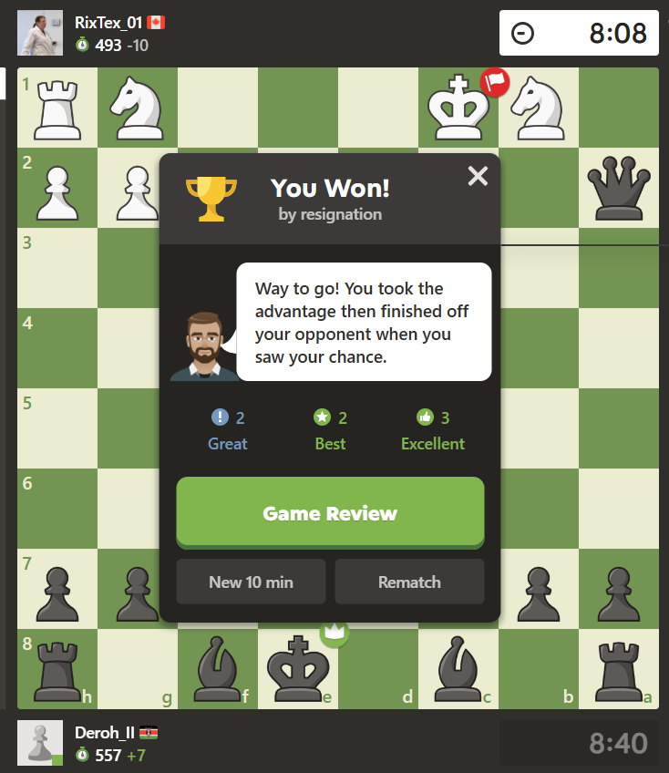

<!-- PROFILE GIF -->

  

<h1 align="center">
  
</h1>

<link href="https://fonts.googleapis.com/css2?family=Libre+Baskerville&display=swap" rel="stylesheet">

I don't just analyze data—I interrogate it until it confesses. From decoding what makes moviegoers cheer to optimizing how football academies scout the next prodigy, I'm on a mission to turn <em>"messi"</em> data into moments of genius.(I really do hope you got my joke 😢)   

  
Currently weaving numbers into narratives at <strong>West Park Football Academy</strong>, where data meets instinct and insights don’t just inform—they disrupt.

---

### 🚀 Projects  
#### 🤝 Collaborations

| Project | Description | Tech Stack |
|--------|-------------|------------|
| 🎬 **[Movie Industry Trend Analysis](https://github.com/TechRotich/Phase-2-Project-Group-5)** | Analyzed trends in the film industry to identify factors influencing box office success. Built regression models to explore relationships between production budget, profit, and profit margins. Presented findings with interactive visualizations to support data-driven content creation for a new movie studio. | Python, Pandas, Seaborn, Matplotlib, Scikit-learn |
| 📊 **[Social Health Insurance Chatbot](https://github.com/ochiengstephen254/capstone_project_group2-)** | Designed and implemented a rule-based chatbot to guide users through healthcare coverage questions related to Kenya’s Social Health Insurance Fund. Integrated with a Flask web app. | Python, Rasa, Flask, YAML |
| 💬 **[Sentiment Analysis on Customer Reviews](https://github.com/Mweru/NLP-Sentiment-Analysis-Project-Group4)** | Performed sentiment analysis on customer reviews to classify opinions as positive, negative, or neutral using NLP techniques for text cleaning, vectorization, and model building. | Python, NLTK, Scikit-learn, Pandas |

#### 🧠 Personal Projects

| Project | Description | Tech Stack |
|--------|-------------|------------|
| 📉 **[Churn Prediction Model](https://github.com/Derrick-code1990/SyriaTel-project)** | Developed a binary classification model to predict customer churn using supervised learning techniques. Performed feature engineering, model tuning, and evaluation using precision, recall, and F1-score. | Python, Scikit-learn, Pandas |

---

### 🌟 Tech & Tools

  <!-- Programming & Data -->
  
  
  
  
  
  
  
  

  <!-- ML & AI -->
  
  
  

  <!-- NLP -->
  
  
  

  <!-- Tools -->
  
  

---

### 🎮 Just for Fun

### *I LOOOOOVVVEEEE PLAYING CHESSSS*

  

> ♟ Currently chasing that elusive Elo 1000—because even pawns have dreams! 😄 

---

### 📬 Let's Connect
Either for a game of chess or Work 😄 

- 📫 **derricknturibi1317@gmail.com**
- 💼 [LinkedIn](https://www.linkedin.com/in/derrick-waititu-a0a50026b/) 

---

Thanks for stopping by! Let’s turn raw data into real impact. 🌍📊⚽

